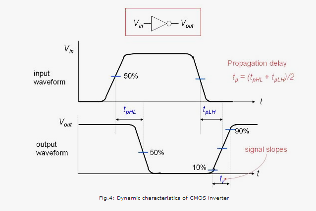
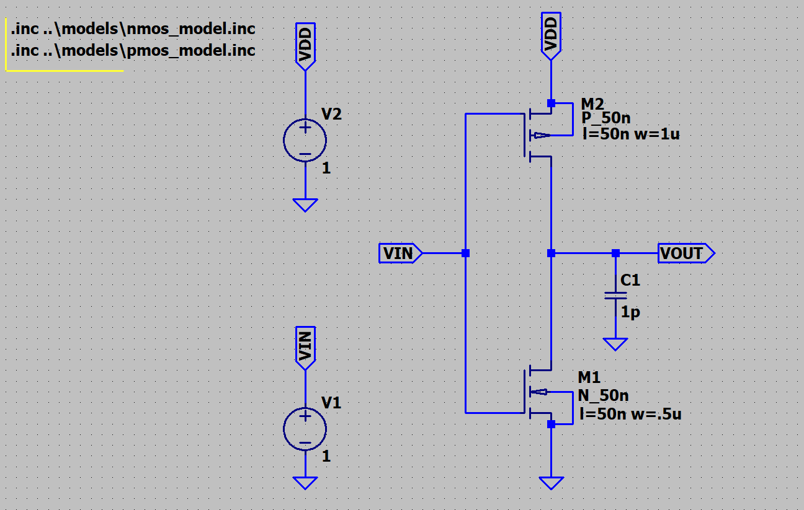
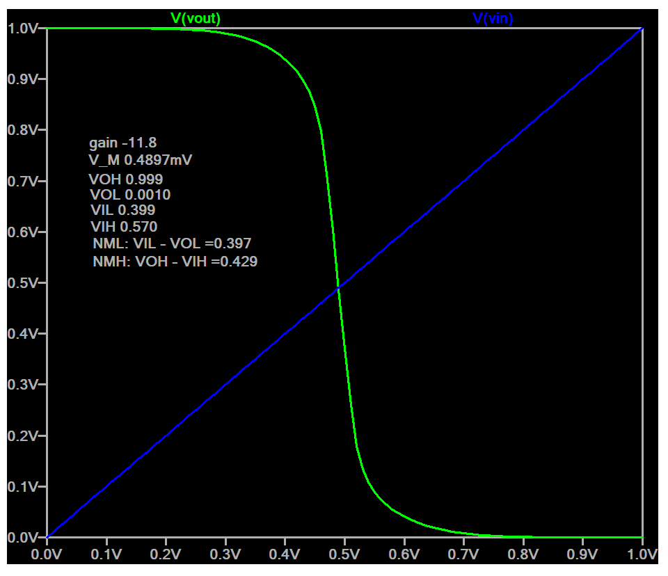
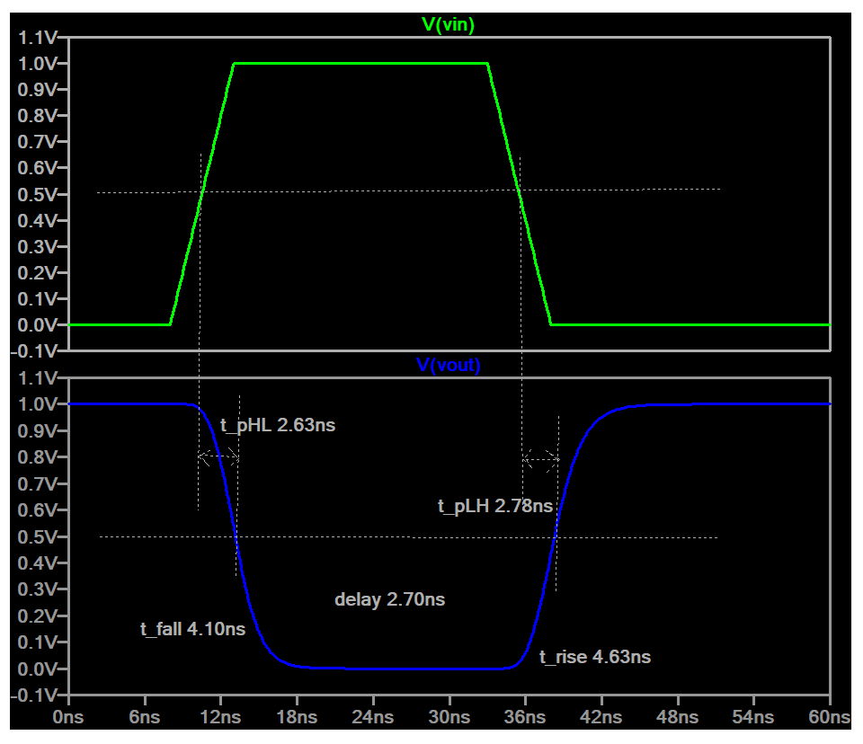
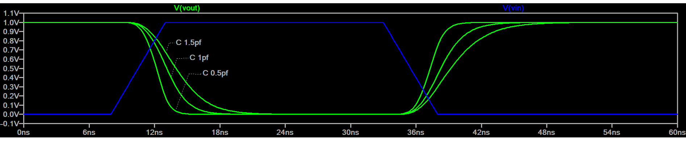

# 🔷 CMOS Inverter Design using LTspice


---

## 📌 Overview

<p align="justify">
This project presents the <b>design and analysis of a CMOS inverter</b> using LTspice. 
The study covers comprehensive simulations including <b>DC, AC, and transient analysis</b> to evaluate circuit performance under different conditions.
</p>

<p align="justify">
Key performance metrics such as <b>propagation delay</b> are analyzed under varying <b>load capacitances</b>, while the 
<b>switching threshold (midpoint voltage)</b> is investigated for different <b>W/L ratios</b> of NMOS and PMOS transistors.
</p>

<p align="justify">
Additionally, the project explores important parameters including <b>power consumption</b>, <b>voltage gain</b>, and 
<b>noise margin</b>, providing a complete understanding of CMOS inverter behavior for VLSI design applications.
</p>


## ⚙️ Tools & Technologies

* LTspice
* BSIM3 (Berkeley Short-Channel IGFET Model)


## 🧠 Design Methodology

### gm/Id-Based Sizing

The transistor sizing is performed using the gm/Id methodology to achieve an optimal trade-off between speed and power.

* Target region: Moderate inversion (gm/Id ≈ 15)
* NMOS width: 1 µm
* PMOS width: 2 µm
* Reason: Mobility ratio compensation for symmetric switching


## 🔌 Circuit Description

* CMOS inverter using NMOS and PMOS
* NMOS W/L: 500n/50n
* PMOS W/L: 1u/50n
* Supply Voltage: 1V
* Load Capacitance: 1pF


## 📊 Simulations Performed

### ✅ DC Analysis

* Voltage Transfer Characteristics (VTC)
* Switching Threshold (VM)
* Noise Margin 
* W/L ratio 
* Crossing Current (Icross)

### ✅ AC Analysis

* Gain
* Bandwidth

### ✅ Transient Analysis

* Switching behavior
* Propagation delay 
* Power measurement


## ⏱️ Propagation Delay

<p align="center">
 	 
</p>

Measured using LTspice `.measure` commands.


## ⚡ Power Dissipation in CMOS

In CMOS circuits, power dissipation occurs due to three main components:

1. **Dynamic Power** – dissipated only during switching  
2. **Leakage Power** – caused by leakage current and exists continuously  
3. **Short-Circuit Power** – occurs when both NMOS and PMOS conduct during switching  

### 📌 Total Power Consumption

```math
P_{total} = P_{switching} + P_{short-circuit} + P_{leakage}

```

```math
P = V_{DD} \times I_{avg}

```
Includes both dynamic and static power components.

### 🔢 Power Components

- **Switching Power:**

  ```math
  P_{switching} = C_{Load} \cdot V_{DD}^2 \cdot f

  ```

- **Short-Circuit Power:**
  ```math
  P_{short-circuit} = t_{sc} \cdot V_{DD} \cdot I_{sc}

  ```

- **Leakage Power:**

  $`P_{leakage} = V_{DD} \cdot I_{leakage}`&
 
Where
* CLoad: Capacitive loading due to output node, interconnects, and fan-out 
* VDD     : Supply voltage 
* f          :  Switching frequency 
* tsc    :  Short-circuit duration in CMOS 
* Isc    :  Short-circuit current from PMOS to NMOS 
* Ileakage:    Leakage current

- Dynamic power dominates at **high frequency**
- Leakage power becomes significant in **deep submicron technologies**
- Short-circuit power depends on **input transition time**


## 📈 Results

<table align="center" border="1" cellpadding="8" cellspacing="0">
  <thead>
    <tr>
      <th>Parameter</th>
      <th>Value</th>
    </tr>
  </thead>
  <tbody>
    <tr>
      <td><b>V<sub>DD</sub></b></td>
      <td>1 V</td>
    </tr>
    <tr>
      <td><b>Propagation Delay</b></td>
      <td>2.70 ns</td>
    </tr>
    <tr>
      <td><b>Power Consumption</b></td>
      <td>XX µW</td>
    </tr>
    <tr>
      <td><b>Gain</b></td>
      <td>11.8</td>
    </tr>
  </tbody>
</table>

## 🖼️ Figures

### CMOS Inverter Schematic



### DC Analysis




### Transient Response







## 📂 Project Structure

```
models/
circuits/
simulations/
results/
calculations/
figures/
simulations/
```

---

## 🚀 Future Work

* Layout design (Magic / Sky130)
* Parasitic extraction
* Monte Carlo analysis

---

## 👤 Author

**Md. Masudun Nabi Siam**
EEE, GSTU
Aspiring Analog & Mixed-Signal VLSI Engineer

---
